# Nytr

**An evidence-driven nutrition and training companion built around Penn State dining.**

Nytr began as a system for answering a deceptively difficult question:

> Given what is actually available at Penn State Harrisburg's Stacks Market today, what should I eat next to stay aligned with my nutrition and training goals?

Rather than treating food availability, body data, workouts, and nutrition targets as
separate systems, Nytr combines them into one deterministic decision pipeline. It
integrates institutional dining data from Stacks Market with HealthKit, food logging,
barcode products, training history, body-goal evidence, and deterministic nutrition
logic to generate daily guidance.

Optional on-device Apple Intelligence can explain the results, but it never determines
the underlying facts or calculations.

```text
        INSTITUTIONAL DINING DATA
                    +
     PERSONAL HEALTH / TRAINING EVIDENCE
                    |
                    v
         DETERMINISTIC CALCULATION
                    |
                    v
      MEAL / TRAINING RECOMMENDATION
                    |
                    v
     OPTIONAL ON-DEVICE AI EXPLANATION
```

> [!NOTE]
> Nytr is an independent student project and is not affiliated with or endorsed by
> The Pennsylvania State University.

---

## Built for a real dining environment

Nytr was originally designed specifically around **Penn State Harrisburg — Stacks
Market**.

Typical fitness apps ask you to search a generic food database and type in what you
think you ate. That is a data-entry problem. Nytr addresses a harder one: reasoning
about the food that is *actually being served* in your dining environment right now,
and deciding what to eat next given everything already recorded today.

Campus dining changes daily. Nutrition targets do not. Closing that gap is the
engineering problem the system was built to solve, and it drives most of the
architecture:

- **Ingest institutional dining data** through a bounded, fail-closed adapter
- **Normalize menu items and nutrition evidence** into typed domain values
- **Preserve provenance and freshness** so every number knows where it came from
- **Distinguish a recommendation from actual consumption** — availability is never
  treated as proof that something was eaten
- **Calculate remaining calorie and protein needs** from recorded intake against
  approved targets
- **Consider remaining meal opportunities** left in the day
- **Recommend what to eat next**, deterministically
- **Combine those decisions with body and training evidence**

That pipeline is the difference between Nytr and a CRUD fitness tracker. Most of the
work is in the ingestion, normalization, provenance, and planning layers rather than
in the UI.

---

## Screenshots

Rendered from synthetic fixtures by the repository's own
[`ProductRenderingTests`](ios/NutritionHealthCompanion/HealthSyncTests/ProductRenderingTests.swift).
No personal health data appears in any image.

### Dark mode

<table>
<tr>
<td align="center"><strong>Today</strong></td>
<td align="center"><strong>Food</strong></td>
<td align="center"><strong>Progress</strong></td>
</tr>
<tr>
<td>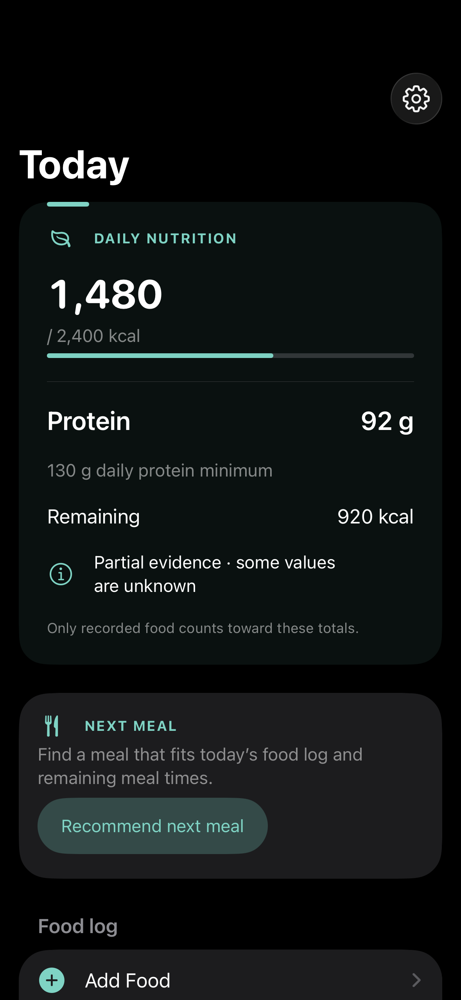</td>
<td>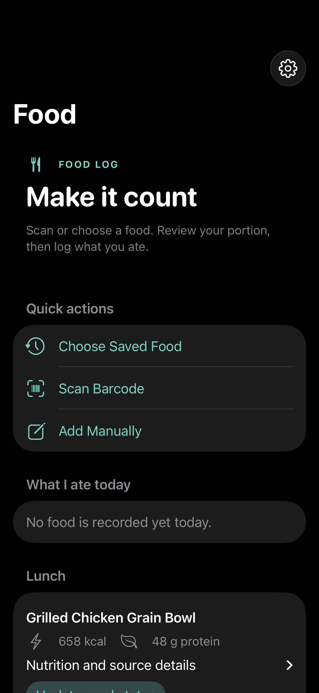</td>
<td>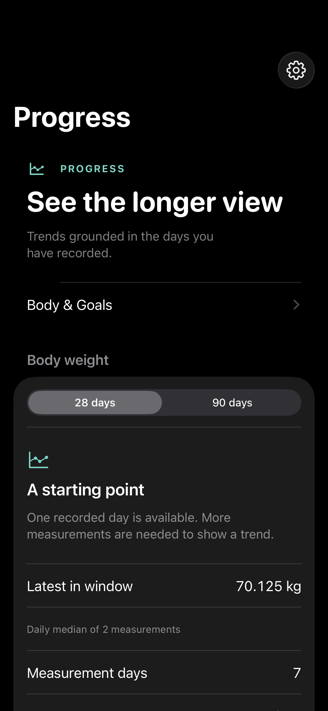</td>
</tr>
<tr>
<td align="center"><strong>Body &amp; Goals</strong></td>
<td align="center"><strong>Training Coaching</strong></td>
<td align="center"><strong>Review</strong></td>
</tr>
<tr>
<td>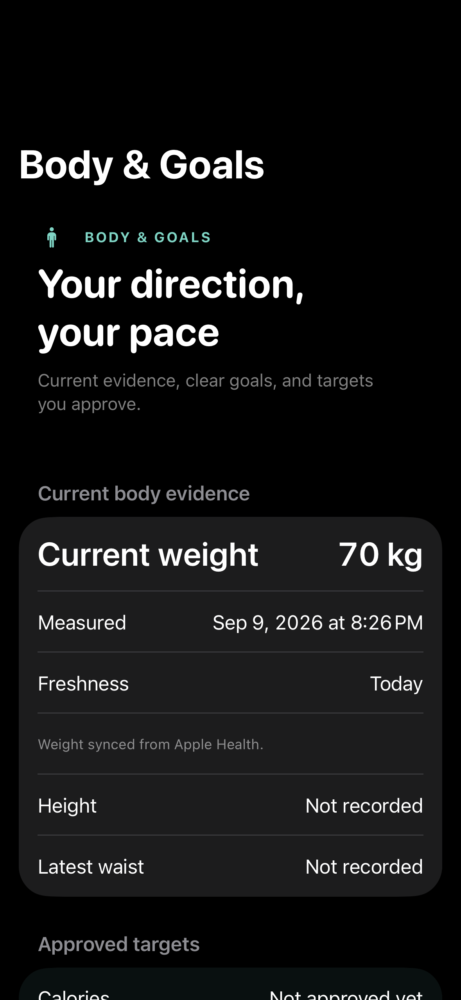</td>
<td>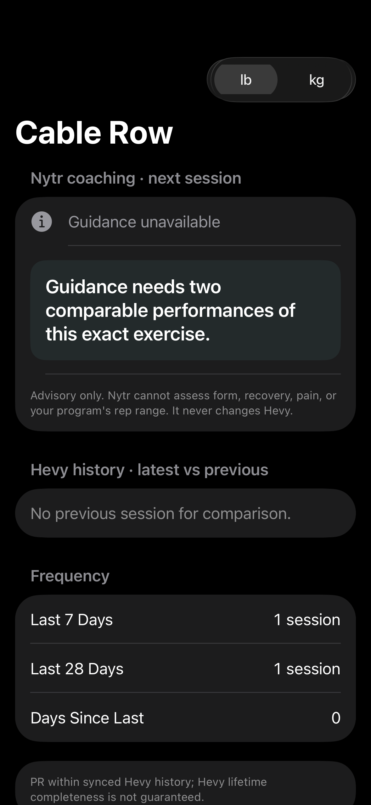</td>
<td>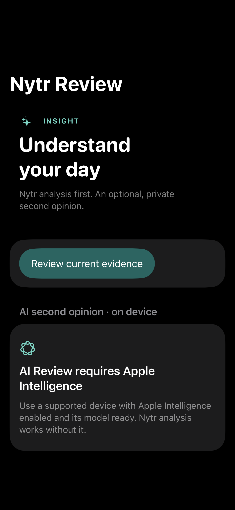</td>
</tr>
</table>

<details>
<summary><strong>Training and Settings (dark)</strong></summary>

<table>
<tr>
<td align="center"><strong>Training</strong></td>
<td align="center"><strong>Settings</strong></td>
<td align="center"><strong>Review analysis</strong></td>
</tr>
<tr>
<td>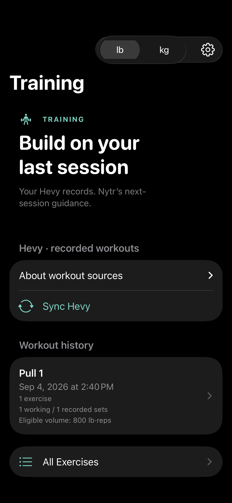</td>
<td>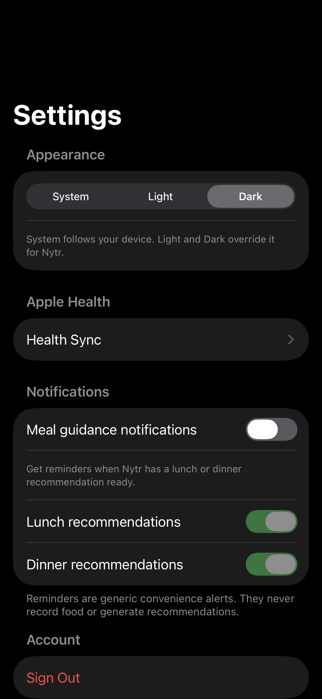</td>
<td>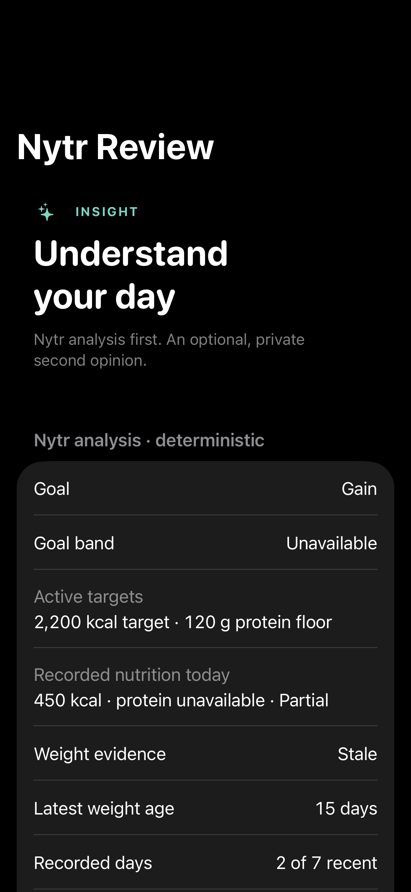</td>
</tr>
</table>

</details>

<details>
<summary><strong>Light mode</strong></summary>

<table>
<tr>
<td align="center"><strong>Today</strong></td>
<td align="center"><strong>Food</strong></td>
<td align="center"><strong>Progress</strong></td>
</tr>
<tr>
<td>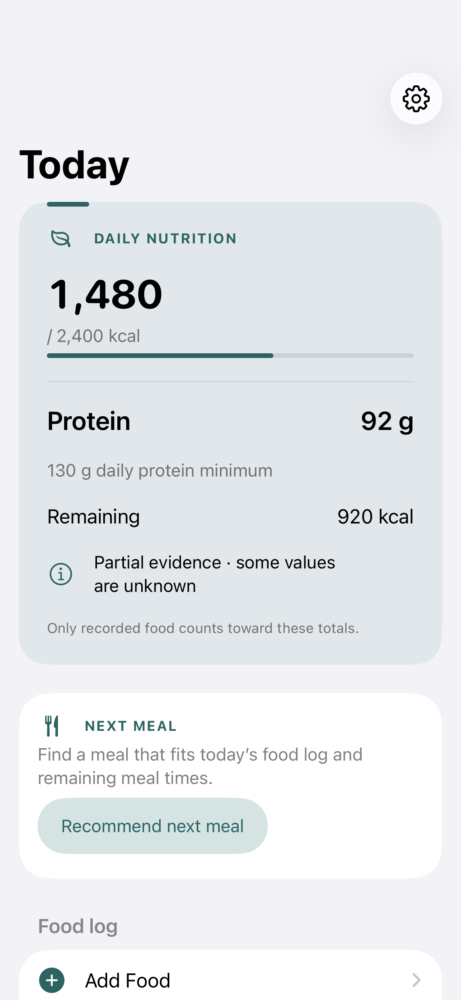</td>
<td>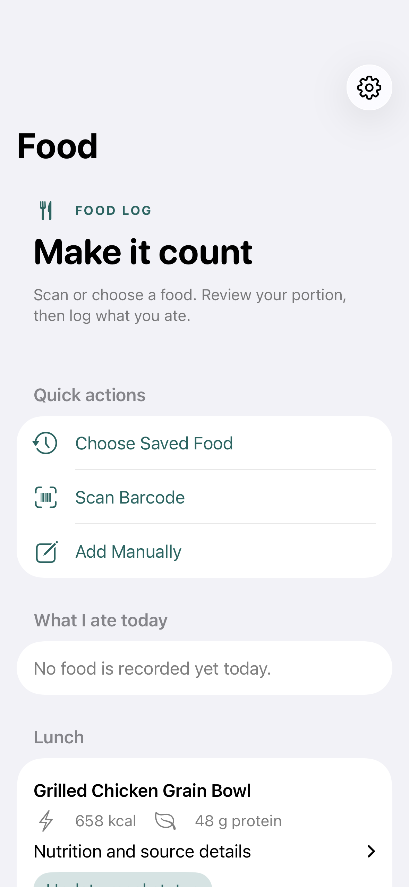</td>
<td>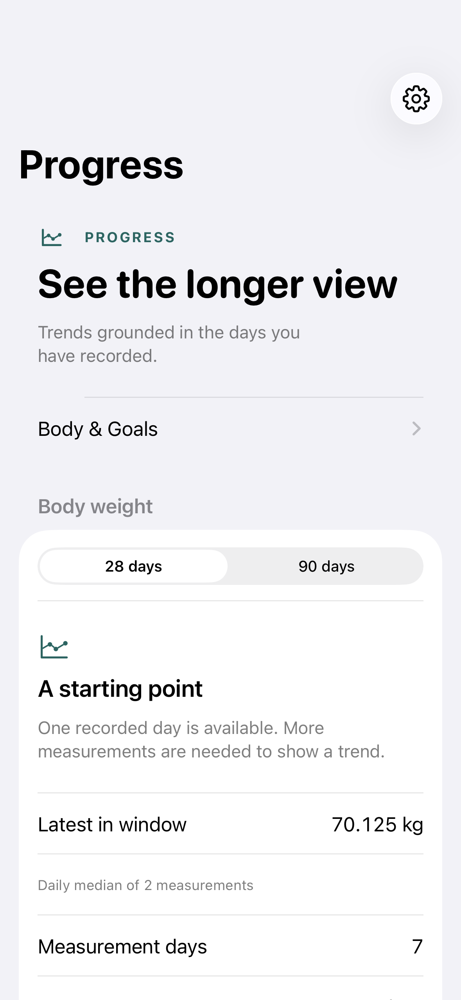</td>
</tr>
<tr>
<td align="center"><strong>Body &amp; Goals</strong></td>
<td align="center"><strong>Training Coaching</strong></td>
<td align="center"><strong>Settings</strong></td>
</tr>
<tr>
<td>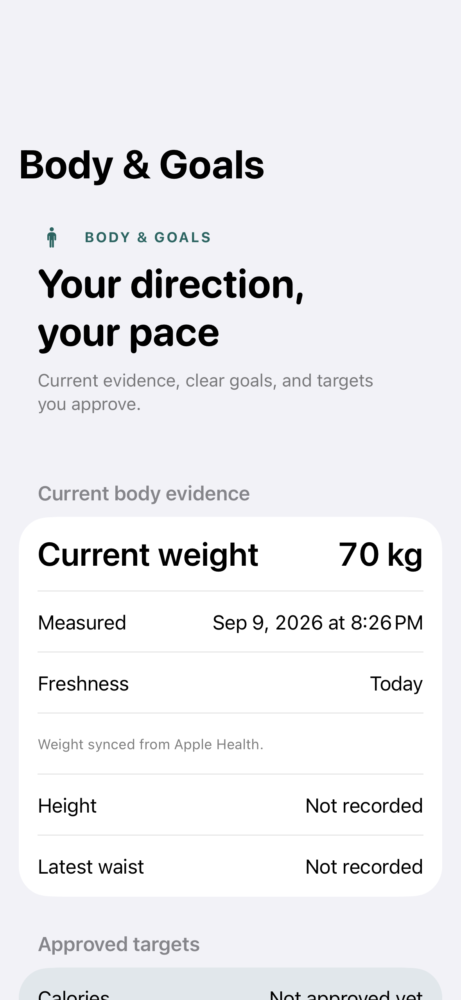</td>
<td>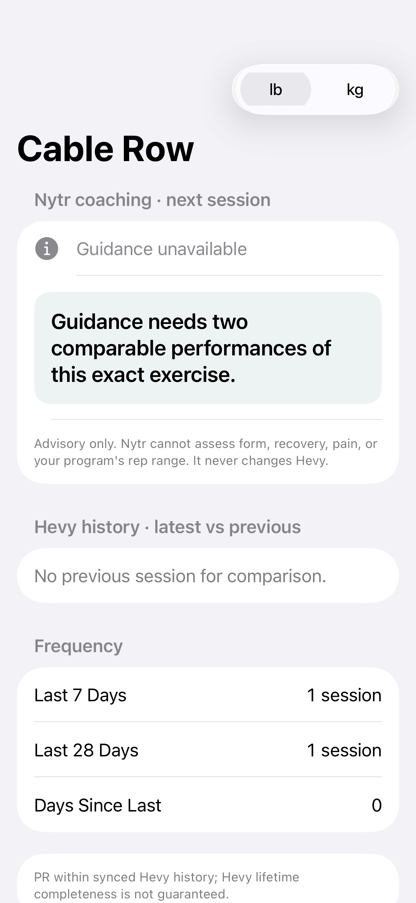</td>
<td>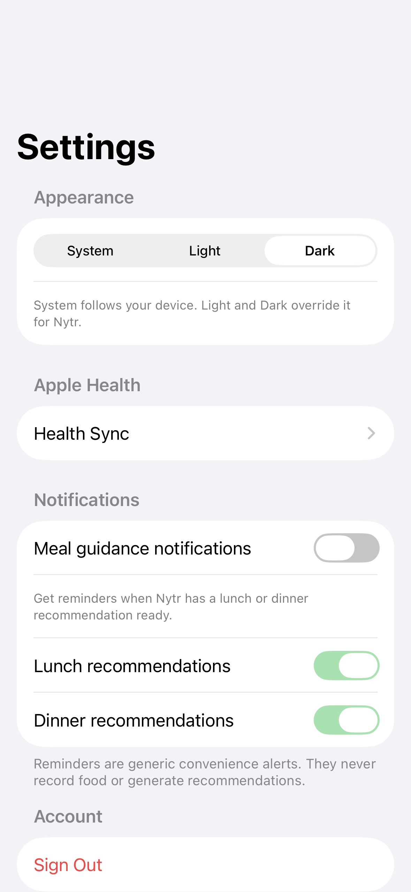</td>
</tr>
</table>

Nytr supports System, Light, and Dark appearance, applied live without restarting.

</details>

---

## Why the architecture looks like this

Nytr started from a personal constraint rather than a generic product idea: campus
dining changes daily, while nutrition targets do not. I wanted a system that could look
at what was actually being served at Stacks Market, combine that with body and training
evidence, and answer *what should I eat next* without outsourcing the decision to a
language model.

Once you take that seriously, a simple tracker stops being sufficient. You need to know
whether a menu item's nutrition is published or estimated, whether a weight reading is
current enough to trust, whether the user actually ate the thing you recommended, and
what to do when any of it is missing. Those questions are what pushed the project into
provenance tracking, versioned evidence, and fail-closed behaviour.

### The authority model

```text
DATA
  Institutional dining availability · HealthKit body mass and workouts
  Hevy training detail · Open Food Facts barcode products · owner-entered foods
      |
      v
DETERMINISTIC CALCULATION
  Typed Python domain. Exact Decimal arithmetic, trend analysis, eligibility
  gating, target proposals, progressive-overload logic. Unit-tested.
      |
      v
RECOMMENDATION
  Concrete, explainable output the owner can accept, edit, or reject.
  Target changes require explicit owner approval.
      |
      v
OPTIONAL AI EXPLANATION
  Prose only. Reads numbers that were already computed. Cannot author,
  correct, or override any fact. Entirely removable.
```

The principles that fall out of it:

- **A recommendation is not a consumption record.** Nytr can suggest a meal and never
  count it. Only an explicit logging action affects totals.
- **Missing data is not zero.** An unknown nutrient stays "unknown" and propagates as
  partial evidence rather than silently becoming `0`.
- **Fail closed.** When evidence is stale, conflicting, or incomplete, Nytr refuses and
  says why instead of guessing. A mass-based product will not be converted to
  millilitres without a verified basis, for example.
- **Immutable, versioned evidence.** Foods, approved targets, and menu snapshots are
  append-only versions rather than mutable rows.
- **Append-only corrections.** Editing or removing a logged food supersedes the earlier
  record; the audit trail is preserved rather than rewritten.
- **Provenance everywhere.** Each value carries its source, authority, fetch time,
  payload digest, and confidence.
- **Deterministic math.** Exact `Decimal` throughout — no floats in nutrition, target,
  or trend arithmetic.
- **AI is strictly downstream.** It reads results; it never produces them.

### Sources and what each is authoritative for

| Source | Authoritative for |
|---|---|
| Institutional dining data (Stacks Market) | Published menu availability and nutrition evidence |
| HealthKit | Body mass observations and workout occurrence |
| Hevy | Detailed exercise and set history |
| Open Food Facts | Packaged product facts resolved by barcode |
| Owner input | Profile, waist evidence, targets, goal direction, consumption decisions |

Nothing outside its column is allowed to overwrite it.

---

## Features

### Dining & Nutrition
- Penn State Harrisburg Stacks Market integration
- Current dining and menu availability as evidence
- Deterministic meal planning over what is actually served
- Lunch and Dinner guidance
- Next Meal recommendations from remaining meal opportunities and remaining macros
- Barcode scanning via VisionKit
- Open Food Facts product resolution with full provenance
- Manual custom foods
- Serving-size evidence and pre-log previews
- What I Ate Today across every source
- Append-only serving corrections and voids
- Nutrition-quality context over recorded intake

### Body & Goals
- HealthKit weight evidence with deduplication and deletion round-trips
- Explicit calorie-target proposal and approval
- Protein targets derived from pinned body-mass evidence
- Waist tracking as supplementary evidence
- Progress trends with freshness and coverage reporting
- Phase assessment over goal direction and observed rate

### Training
- HealthKit workout occurrence
- Hevy detailed training history with source-authoritative set detail
- Deterministic training coaching
- Progressive-overload guidance
- lb/kg presentation toggle

### Intelligence
- Apple Foundation Models, running on device
- Optional Nytr Review second opinion
- Structured explanation of already-computed evidence
- Non-authoritative by construction
- No OpenAI or Gemini cloud API required for this feature

### Product
- Local meal-guidance notifications
- System / Light / Dark appearance, applied live
- iOS-native SwiftUI interface
- Privacy-conscious architecture

### On-device Apple Intelligence, precisely

- Inference is local. Evidence does not leave the device for this path.
- It requires a device and OS that support Apple Intelligence, with the feature enabled
  and its model downloaded. Nytr checks `SystemLanguageModel` availability and degrades
  gracefully. **Not every iPhone supports Apple Intelligence.**
- Deterministic Nytr analysis is shown first and remains the authority for every number.
- A provider-neutral cloud port also exists but is **disabled by default** and is
  equally non-authoritative.

---

## Tech stack

**iOS** — Swift, SwiftUI, HealthKit, Swift Charts, VisionKit, UserNotifications, and
Foundation Models where available. Observable view models, no third-party Swift
packages.

**Backend** — Python 3.11+, FastAPI, PostgreSQL/Supabase with row-level security,
psycopg, Pydantic. A typed domain layer owns all arithmetic and is independent of
FastAPI, the database driver, and any provider SDK.

**Engineering practices**

- Strict `mypy`, `Ruff` lint and format across the backend
- ~1,000 backend tests and ~250 iOS tests, including render and appearance regression
  tests
- Versioned policies (`barcode-food-import.v3`,
  `next-meal.remaining-opportunities.v2`) so behaviour changes are explicit and
  historical records stay reproducible
- Immutable, append-only records for foods, corrections, and approved targets

---

## Local setup

```bash
cp .env.example .env

cd backend
python -m venv .venv
.venv/bin/pip install -e '.[dev]'
.venv/bin/pytest
.venv/bin/ruff check src tests
.venv/bin/mypy
```

No credentials are needed for the test suite. Database-backed integration tests skip
unless `STACKS_TEST_DATABASE_URL` points at a scratch Postgres, and institutional
ingestion is disabled by default.

For iOS, generate the Xcode project from
`ios/NutritionHealthCompanion/Project/project.yml` (via
[XcodeGen](https://github.com/yonaskolb/XcodeGen)) and supply local values through
`Config.xcconfig`. A non-Xcode typecheck harness is available:

```bash
ios/Harness/run_harness.sh
```

Never commit local credentials.

---

## Privacy and demo data

This public repository contains **synthetic fixtures and demo-safe values only**.

- No owner production health records — no real weight, waist, body measurements,
  calorie history, or consumption history
- No production credentials, database URLs, or deployment configuration
- No institutional dining pages, menus, item identifiers, or scraped source content
- No real training history
- Screenshots are rendered from fabricated fixtures

The README describes the real Penn State Harrisburg use case, while every fixture and
test value in the repository is fabricated. Parser fixtures under
`tests/fixtures/stacks/` exercise menu and label states without reproducing provider
pages — see that directory's manifest. Open Food Facts attribution obligations are
described in [THIRD_PARTY_NOTICES.md](THIRD_PARTY_NOTICES.md).

---

## What's next

These are future directions, **not currently released functionality**.

- [ ] **Expand to Penn State dining locations beyond Stacks Market**
- [ ] Android client
- [ ] Apple App Store release
- [ ] Google Play release

### Broader Penn State dining support

This is the priority. Today the deterministic planning pipeline is proven against a
single dining location. The goal is to **support dining options across Penn State
rather than one dining hall.**

The adapter boundary was deliberately written to be provider-neutral, so the work is
generalizing location and provider identity through the ingestion, normalization, and
planning layers — letting additional dining locations plug into the same evidence rules,
provenance model, and planner without special-casing any of them. The interesting part
is keeping determinism and fail-closed behaviour intact as menu shapes and publishing
habits vary between locations.

### Android

Bring the Nytr experience to Android while preserving the same deterministic backend and
evidence rules, so both clients render the same authoritative calculations. No Android
client exists today.

### Apple App Store

Prepare the iOS application for broader distribution through the App Store. It is not
currently published there.

### Google Play

Once the Android client exists, prepare it for distribution through Google Play. No Play
Store release exists today.

---

## Project status

Production-validated personal project; this public repository contains a sanitized,
reproducible version of the codebase.

Further reading: [architecture notes](docs/ARCHITECTURE.md) ·
[nutrition engine](docs/NUTRITION_ENGINE.md) ·
[dining integration boundary](docs/STACKS_DISCOVERY.md) ·
[AI architecture](docs/LLM_ARCHITECTURE.md) ·
[Body & Goals](docs/BODY_GOALS.md) ·
[security and privacy](SECURITY.md) ·
[contributing](CONTRIBUTING.md)

## License

[MIT](LICENSE) for Nytr's own source. Third-party data and frameworks retain their own
terms — see [THIRD_PARTY_NOTICES.md](THIRD_PARTY_NOTICES.md).
